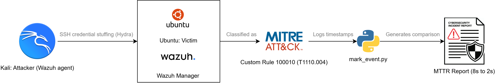
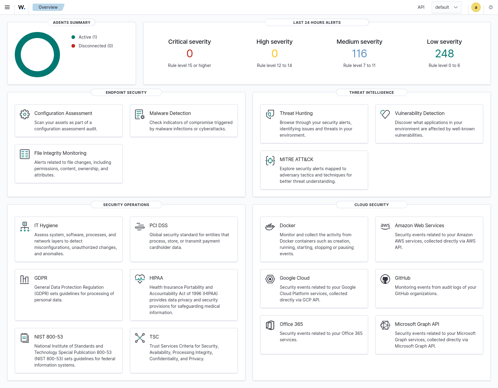
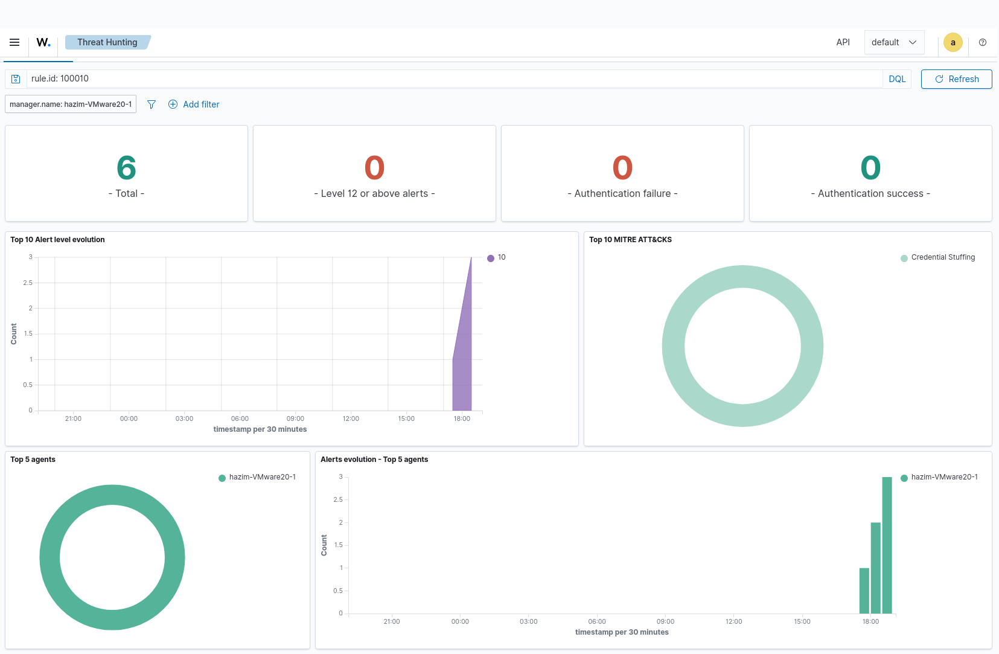
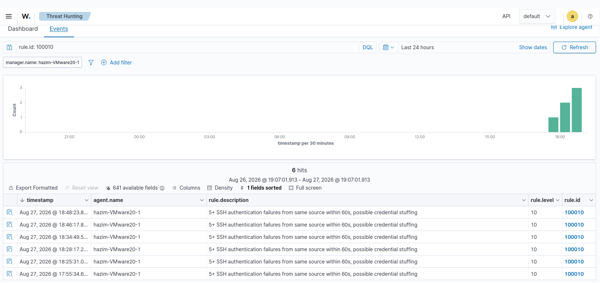
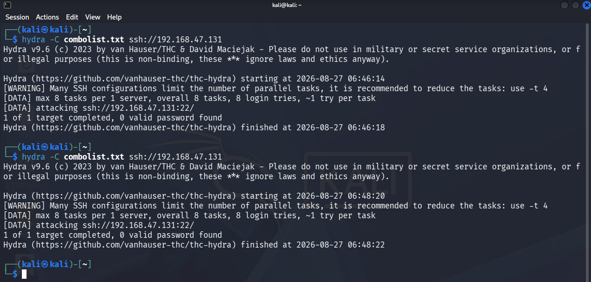
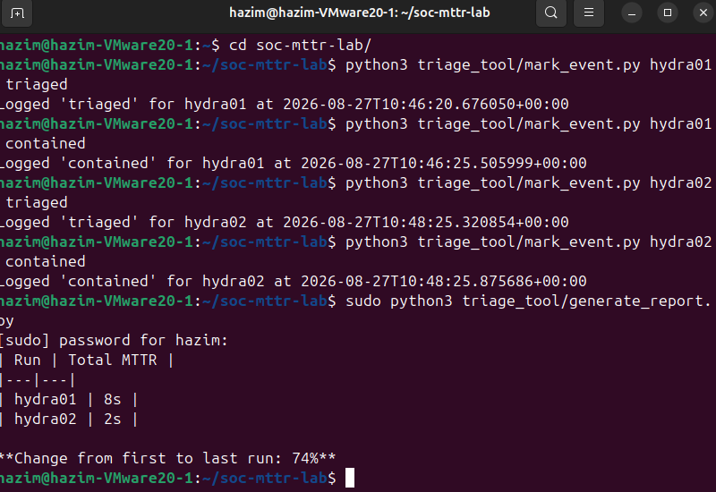
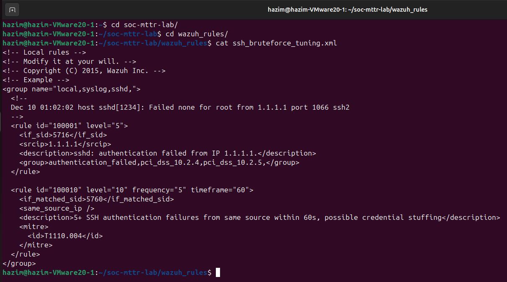

# SOC Incident Response: Automated Credential-Stuffing Detection & Response

**Cut simulated incident response time from 8 seconds to 2 seconds, using a detection rule I designed, tuned, and defended myself.**

**Jump to:** [Executive Summary](#executive-summary) · [Architecture](#architecture) · [Results](#results) · [Response Lifecycle](#response-lifecycle-nist-csf-20) · [Full Technical Breakdown](#full-technical-breakdown) · [References](#references)

---

## Executive Summary

**The problem: undetected credential-based intrusions are expensive, and the cost is mostly about speed.**
> Breaches contained in under 200 days cost $4.32M on average, compared to $5.65M for slower ones, a $1.33M gap. ([IBM Cost of a Data Breach Report 2026](https://www.ibm.com/reports/data-breach))

**What I built: a live, two-machine attack simulation with a custom detection rule, measured end to end.**
> A custom Wazuh rule mapped to MITRE ATT&CK T1110.004 (credential stuffing), built on Wazuh, a SIEM (Security Information and Event Management platform: it collects and correlates logs across a network to detect attacks in real time).
>
> A Python pipeline automatically measures response time from detection to containment, no manual stopwatch.

**The impact: detect-to-contain time cut from 8s to 2s, backed by real logs, not estimates.**
> Credential stuffing targets anything with a login. This scenario used SSH, but the same detect-and-contain logic applies to VPNs, admin panels, and cloud consoles, not just this one protocol.

**Why it matters at Dell, SLB, and Siemens Energy specifically:**
> Dell is addressing credential-based attacks directly, through hardware-based credential protection and passwordless strategies. ([Dell Technologies](https://www.dell.com/en-us/blog/how-to-weather-the-cyber-identity-crisis/))
>
> A Schlumberger security lead described this exact triage-speed problem at enterprise scale, this project is a small, hands-on version of that same challenge. ([JPT](https://jpt.spe.org/oil-and-gas-data-multiply-so-do-cybersecurity-threats))
>
> Siemens Energy's own cybersecurity page lists insecure employee behavior among the risks facing industrial and IIoT systems, the same human-factor gap credential stuffing exploits. ([Siemens Energy](https://www.siemens-energy.com/global/en/home/company/cybersecurity.html))
>
> These three are examples, not the limit: any company with a login and a SOC has this exact detection-speed problem.

---

## Architecture

*Two machines, one attack, fully automated measurement:*



---

## Results

*MTTR (Mean Time to Respond), measured automatically, not estimated:*

| Run | MTTR |
|---|---|
| hydra01 | 8s |
| hydra02 | 2s |

**MTTR reduced by 74% (first run to most recent run)**

*Two runs, not a statistical trend, a real demonstration that response time is trainable.*

---

## Response Lifecycle (NIST CSF 2.0)

> NIST CSF 2.0: the U.S. National Institute of Standards and Technology's cybersecurity framework, six functions that structure how a security team handles a threat from start to finish, used here to organize what I actually did. ([NIST SP 800-61r3](https://nvlpubs.nist.gov/nistpubs/SpecialPublications/NIST.SP.800-61r3.pdf))

| Function | What I Did |
|---|---|
| Govern | Scoped the project to one fully defensible, measurable scenario rather than several shallow ones, deliberately cutting lower-priority additions (off-hours escalation, a second attack type, third-party dataset validation) |
| Identify | Researched current credential-stuffing prevalence to build a realistic, evidence-based scenario |
| Protect | Tuned the detection threshold to 5 attempts/60s to avoid flagging genuine password mistakes, based on real-world lockout conventions |
| Detect | Custom Wazuh rule flags the pattern live, mapped to MITRE ATT&CK T1110.004 |
| Respond | Automated timestamp logging measured the full detect-to-contain window |
| Recover | Found and fixed a bug where response times were measured against the wrong detection event, causing inflated results. Recommended key-based SSH, auto-lockout, and MFA for production hardening. |

**Relevant to:** SOC Analyst · Incident Response · SIEM (Wazuh) · MITRE ATT&CK · Python · Detection Engineering · MTTR

---

## Full Technical Breakdown

**Tech stack**

| Layer | Tools |
|---|---|
| SIEM | Wazuh 4.14 (indexer, manager, dashboard) |
| Attack simulation | Kali Linux, Hydra |
| Automation | Python 3 |
| Environment | VMware Workstation, Ubuntu 24.04 + Kali, both running real Wazuh agents |

**The detection rule**

> MITRE ATT&CK: the industry-standard, publicly maintained catalog of real-world attack techniques. T1110.004 is the ID for credential stuffing specifically, mapping this rule to a technique any SOC analyst would recognize. ([MITRE](https://attack.mitre.org/techniques/T1110/004/))

```xml
<rule id="100010" level="10" frequency="5" timeframe="60">
  <if_matched_sid>5760</if_matched_sid>
  <same_source_ip />
  <description>5+ SSH authentication failures from same source within 60s, possible credential stuffing</description>
  <mitre><id>T1110.004</id></mitre>
</rule>
```

**Evidence**

<table>
<tr>
<td width="50%">

**Figure 1: Wazuh dashboard**<br>
Live agent connected, real alert volume.



</td>
<td width="50%">

**Figure 2: MITRE ATT&CK mapping**<br>
Alerts filtered to rule 100010, confirming Credential Stuffing.



</td>
</tr>
<tr>
<td width="50%">

**Figure 3: Alert events**<br>
Six real detections with timestamps, the raw evidence behind Figure 2.



</td>
<td width="50%">

**Figure 4: The attack itself**<br>
Credential-stuffing attack launched from Kali against the target.



</td>
</tr>
<tr>
<td width="50%">

**Figure 5: Automated report**<br>
`generate_report.py` producing the real 8s-to-2s comparison.



</td>
<td width="50%">

**Figure 6: The detection rule**<br>
The custom Wazuh rule, confirmed directly from the file.



</td>
</tr>
</table>

**All bugs hit and resolved**
- Disk too small for Wazuh's full stack, resized and repartitioned
- Wrong usernames in the attack list triggered the wrong rule entirely
- Timezone mismatch crashed the timing script, made both sides UTC-aware
- Stale alert matching silently inflated a result, fixed by matching each triage to the closest prior detection

**Run it**
```bash
git clone https://github.com/aliffhazim/soc-mttr-lab
python3 triage_tool/mark_event.py <run_id> triaged
python3 triage_tool/mark_event.py <run_id> contained
sudo python3 triage_tool/generate_report.py
```

---

## References
- IBM Cost of a Data Breach Report 2026: https://www.ibm.com/reports/data-breach
- Dell Technologies, "How To Weather the Cyber Identity Crisis": https://www.dell.com/en-us/blog/how-to-weather-the-cyber-identity-crisis/
- Journal of Petroleum Technology, alert-triage automation in energy/critical infrastructure: https://jpt.spe.org/oil-and-gas-data-multiply-so-do-cybersecurity-threats
- MITRE ATT&CK, T1110.004 Credential Stuffing: https://attack.mitre.org/techniques/T1110/004/
- NIST SP 800-61r3, Incident Response Recommendations (CSF 2.0): https://nvlpubs.nist.gov/nistpubs/SpecialPublications/NIST.SP.800-61r3.pdf
